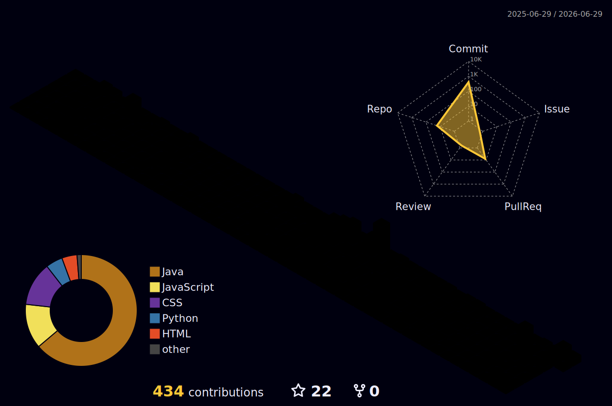

  

<h3 align="center">Passionate Python Developer | AI/ML Enthusiast | Problem Solver</h3>

  
  

 

### 🚀 About Me

- 🔭 I’m currently working on **AI & ML, Deep Learning, Agentic AI, Gen AI, Prompt Engineering, Feature Engineering, and Python Development**
- 🌱 I’m currently learning **Advanced AI/ML frameworks and tools**
- 💬 Ask me about **Python, Data Science, AI/ML, and Web Technologies**
- ⚡ **Soft Skills:** Leadership, Problem Solving, Quick Learning
- 📫 How to reach me: **[suriya22714@gmail.com](mailto:suriya22714@gmail.com)**
- ⚡ Fun fact: **I love solving LeetCode problems!**

 

  

 

### 🏆 Achievements

- **Full Stack Developer Intern** at **TechnoHacks Edutech** 💼
  - Successfully completed internship focusing on web development and problem solving.

 

### 🛠️ Languages and Tools

  
  
    
  
  
  
  
  
  
  
    
  
  

 

### 📊 GitHub Stats

  

 

### 📈 Contribution Graph

  

 

### 🔗 Connect with Me

 
  
  
  
  

 

  

  

<h3 align="center">Passionate Python Developer | AI/ML Enthusiast | Problem Solver</h3>

  
  

 

### 🚀 About Me

- 🔭 I’m currently working on **AI & ML, Deep Learning, Agentic AI, Gen AI, Prompt Engineering, Feature Engineering, and Python Development**
- 🌱 I’m currently learning **Advanced AI/ML frameworks and tools**
- 💬 Ask me about **Python, Data Science, AI/ML, and Web Technologies**
- ⚡ **Soft Skills:** Leadership, Problem Solving, Quick Learning
- 📫 How to reach me: **[suriya22714@gmail.com](mailto:suriya22714@gmail.com)**
- ⚡ Fun fact: **I love solving LeetCode problems!**

 

  

 

### 🏆 Achievements

- **Full Stack Developer Intern** at **TechnoHacks Edutech** 💼
  - Successfully completed internship focusing on web development and problem solving.

 

### 🛠️ Languages and Tools

  
  
    
  
  
  
  
  
  
  
    
  
  

 

### 📊 GitHub Stats

  

 

### 📈 Contribution Graph

  

 

### 🔗 Connect with Me

 
  
  
  
  

 

  

